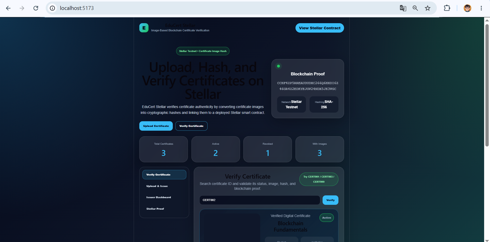
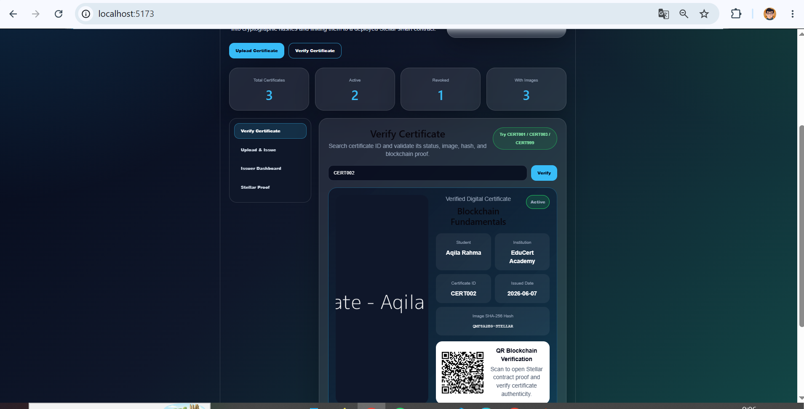
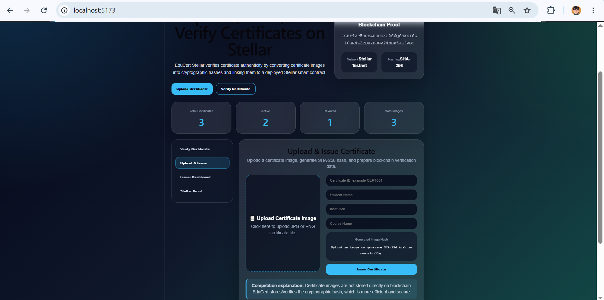
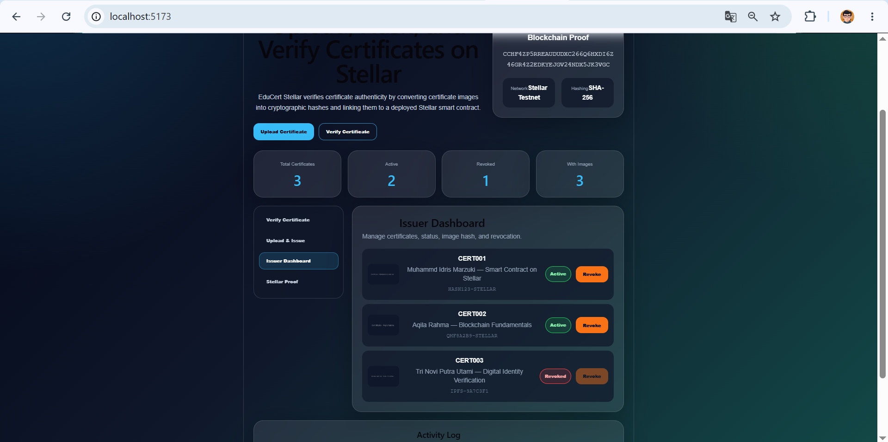
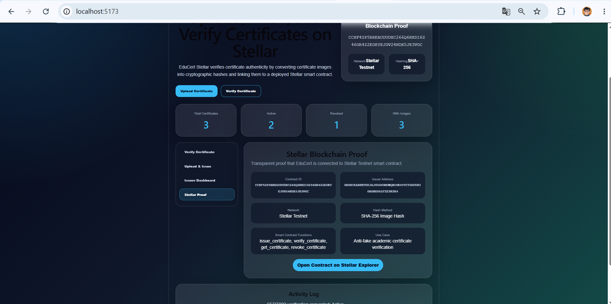
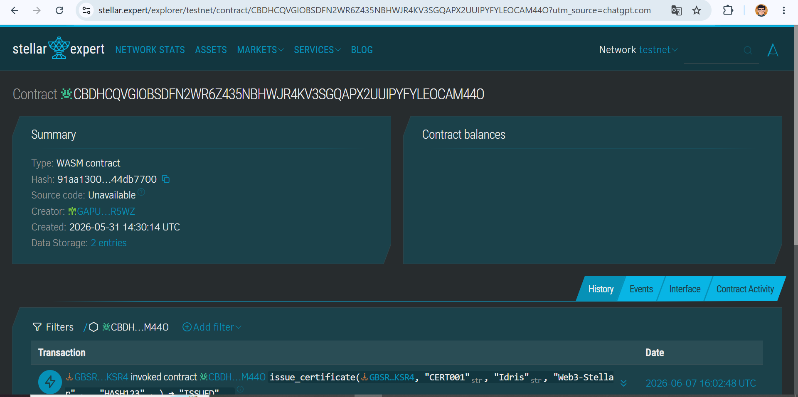

Project Stellar

Blockchain-Based Certificate Verification Platform built on Stellar Soroban Smart Contracts.

---

## 📌 Overview

EduCert Stellar is a decentralized certificate verification platform that enables educational institutions, bootcamps, and training centers to issue, verify, and revoke digital certificates securely using Stellar blockchain technology.

The platform helps reduce fake certificates by providing immutable blockchain verification, QR-based validation, certificate image hashing, and transparent certificate status tracking.

---

## 🌟 Key Features

- Certificate Verification  
- Blockchain-Based Certificate Validation  
- QR Code Verification  
- Certificate Image Upload  
- SHA-256 Image Hashing  
- Revoked Certificate Detection  
- Issuer Dashboard  
- Stellar Soroban Smart Contract  
- Modern Web3 User Interface  
- Activity Log Monitoring  
- Blockchain Proof Explorer Integration  

---

## 🛠️ Tech Stack

### Frontend
- React.js  
- Vite  
- CSS3  
- QRCode React  

### Blockchain
- Stellar Soroban Smart Contracts  
- Rust  
- Stellar CLI  

### Security
- SHA-256 Image Hashing  
- Blockchain Verification  

---

## 🔗 Smart Contract Information

### Contract ID

CCHF4ZP5RREAUDUDXC266Q6HXDI6Z46GR4Z2EDKYEJGV24NDX5JK3VGC

### Issuer Address

GBSRCEARHBTEEJAJ6OG6UMOWQBO6K4YYCTDGUOHIGRGNXPA5FZESKSR4

### Network

Stellar Testnet

### Stellar Explorer

https://stellar.expert/explorer/testnet/contract/CCHF4ZP5RREAUDUDXC266Q6HXDI6Z46GR4Z2EDKYEJGV24NDX5JK3VGC

---

## 📷 Frontend Preview

### 🏠 Home Page

---

### ✅ Certificate Verification

---

### 📄 Upload Certificate Image

---

### 📊 Issuer Dashboard

---

### 🔗 Stellar Blockchain Proof

---

### Stellar Expert

---

## ⚡ Smart Contract Functions

### issue_certificate()
Issues a new digital certificate and stores its verification data on Stellar blockchain.

---

### verify_certificate()
Verifies whether a certificate is valid, active, revoked, or fake.

---

### revoke_certificate()
Revokes certificates that are invalid, fraudulent, or expired.

---

## 🧪 Demo Certificate IDs

| Certificate ID | Status |
|----------------|--------|
| CERT001        | Active |
| CERT002        | Active |
| CERT003        | Revoked |

---

## 🚀 Installation

### Clone Repository

bash
git clone https://github.com/marzuki23/resin-stellar.git

---

Frontend Setup
cd frontend
npm install
npm run dev

---

🔨 Smart Contract Deployment
Build Smart Contract
stellar contract build
Deploy Smart Contract
stellar contract deploy --wasm target/wasm32v1-none/release/hello_world.wasm --source alice --network testnet

---

🎯 Problem Statement

Fake certificates and unverifiable credentials are major issues in digital education systems.

Many institutions still rely on centralized or paper-based verification systems that are vulnerable to manipulation and forgery.

---

💡 How It Works
User uploads certificate image
System generates SHA-256 hash
Hash is stored via smart contract
Certificate is verified using ID or QR
Blockchain ensures authenticity

---

🔒 Security Approach
Certificate images are stored off-chain
Only SHA-256 hashes are stored on blockchain
Ensures privacy, scalability, and efficiency

---

🌍 Future Improvements
Wallet Authentication
IPFS Integration
NFT-Based Certificates
Mainnet Deployment
Multi-Institution Support
Real-Time Blockchain Sync
AI-Based Fake Certificate Detection

---

👨‍💻 Developer

Muhammad Idris Marzuki

Stellar Web3 Competition Project

---

📜 License

Educational project for Stellar Web3 competition submission.
